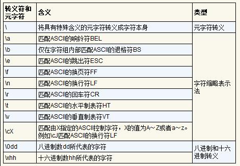
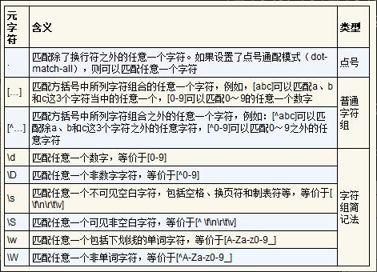
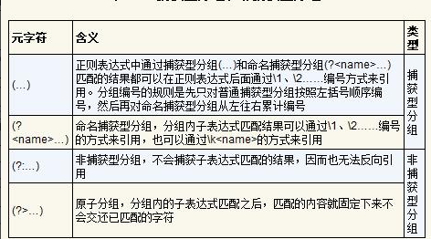
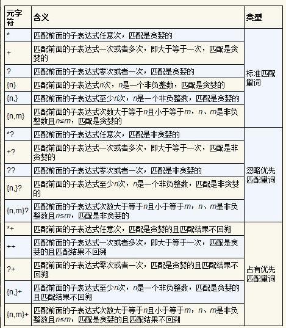
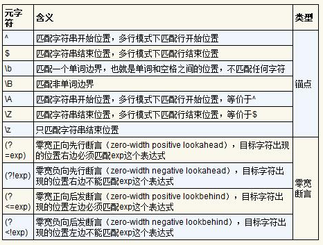
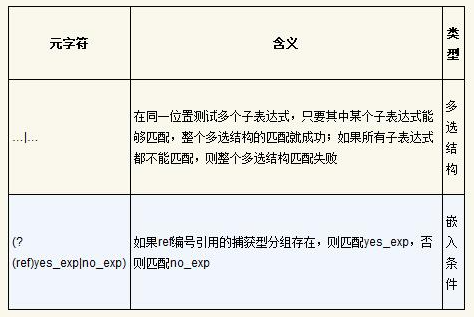
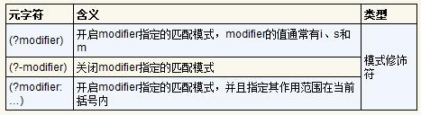

### 1、转义符


* 利用字符缩略表示法来匹配其他方式很难描述的ASCII控制字符和不可打印字符，最常见的就是\n匹配换行符LF，\r匹配回车符CR。其中一个特别的用法是用\cX来匹配X指明的控制字符，X的值为A～Z或者a～z，例如\cJ匹配换行符LF，\cM匹配回车符CR

* 八进制转义和十六进制转义。\0dd表示八进制数dd所代表的字符，\xhh表示十六进制数hh所代表的字符

### 2、字符组


* 点号可以匹配除了换行符之外的任意一个字符，如果设置了点号通配模式（dot-match-all）​，则可以匹配任意一个字符

* 普通字符组指通过[…]来匹配方括号中所列字符组合中的任意一个字符，或者通过[^…]来匹配方括号中所列字符组合之外的任意一个字符

* 需要强调的是，元字符的规定在字符组内外是有差别的

* *在字符组外部：量词元字符，表示前面的元素出现0次或多次，而在字符组内容，仅作为普通字符，匹配字面意义的星号

* -连字符，在字符组外部，匹配字面意义的连字符，而在字符组内部，表示字符范围，如[a-z] 匹配任意小写字母

* ^脱字符，字符组外部，锚点元字符，匹配字符串开头，如^abd匹配以"abc"开头的字符串，字符串内部：当第一个位置是元字符，表示取反，如[^abd]匹配不是"a"、"b"、"c"的任意字符

* \b在字符组外部，表示单词边界断言，匹配单词的开始或结束位置，而在字符组内部，匹配ASCLL退格符
```javascript
// 测试字符串
const text = "hello\bworld back";

// 字符组外部的 \b - 匹配单词边界
const wordBoundaryRegex = /\bback\b/;
console.log(wordBoundaryRegex.test(text)); // true - 匹配单词"back"

// 字符组内部的 \b - 匹配退格符  
const backspaceRegex = /[\b]/;
console.log(backspaceRegex.test(text)); // true - 匹配退格符
```


### 3、分组


分组是使用圆括号()将正则表达式的一部分包裹起来，被()包裹起来的部分就是一个捕获分组

#### 分组的主要用途
* 将多个字符作为一个整体，如(ab)+，将ab视为整体，匹配一个或多个ab
* 反向引用，在同一个正则表达式内部，使用 \1, \2, \3, ... 来引用前面已经定义的分组所匹配到的完全相同的文本
```
# 如匹配cat cat字符串
# 正则表达式如下
(\w+)\s+\1
```
1. (\w+) 匹配一个或多个单词，同时作为一个分组，此处为分组1
2. \s+ 匹配一个或多个空白字符
3. \1 反向引用，此处表示出现和分组1一模一样的文本

* 在替换中使用分组
```
将 2023-10-25 改为 25/10/2023。

查找正则表达式： (\d{4})-(\d{2})-(\d{2})

替换为字符串： $3/$2/$1 或 \3/\2/\1
```

#### 特殊分组：非捕获分组
如果只想使用圆括号来表示()分组，但不想捕获其内容，可以使用``(?:子表达式)``
```
# 字符串 abcxyz
正则表达式：(?:abc|xyz){2}
此时 $1 不会选中abc，还属于待匹配状态
```


### 4、匹配量词


* 标准匹配量词包括*、+、？、{n}、{n, m}，标准匹配量词都是贪婪的，尽可能匹配更多内容，如ab+匹配字符串abbbb时，量词+会尽可能匹配字母b，最终匹配结果为abbbb

* 忽略优先量词是在标准匹配量词之后紧跟?修饰符，即*?、+?、??、{n}?、{n,}? 和(n,m)?,忽略优先量词和匹配优先量词正好相反，是非贪婪的，会尽可能少地匹配内容

* 占有优先量词是在标准匹配量词之后接+字符，即*+、++、?+、{n}+、{n,}+和{n,m}+。占有优先量词类似于标准匹配量词，但是匹配的结果不会“交还”或者说回溯。举例来说，当正则表达式a.*b和a.*+b同时去匹配字符串acccb时，a.*b会匹配成功，而a.*+b会匹配失败。原因是不管是.*还是.*+，它们都是匹配优先的，并且“贪婪”地匹配到了字符串acccb中的cccb, 但是.*+不会回溯已匹配到的结果，所以正则表达式 a.*+b 中的b会发现这时候字符串中已经没有b可以匹配，从而整个正则表达式匹配失败。占有优先量词能够控制匹配和不能匹配的内容，在某些场合下使用占有优先量词能够提高匹配效率

### 5、锚点和零宽断言



### 6、多选结构和嵌入条件


* 多选结构常常和嵌入条件一起使用，如表上所示。常用的嵌入条件形式是(?(ref)yes_exp|no_exp)，表示如果编号ref引用的捕获型分组存在，则匹配yes_exp，否则匹配no_exp。例如，上海地区固定电话号码一般写成021-12345678或者(021)12345678，可以用正则表达式(()?021(?(\1))|-)\d{8}来匹配这两种写法。其中(?(\1))|-)部分表示如果前面(()捕获到了匹配，那么继续匹配一个右括号)，否则匹配一个横线-。

### 7、模式修饰符


* i:表示忽略大小写模式
* s:表示点号通配模式，即点号可以匹配换行符
* m:表示多行模式，在这种模式下^、$、\A和\Z这些锚点符匹配地是行起始位置

